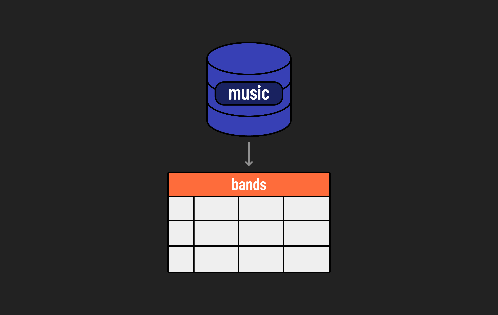

<h1>
  <span class="headline">Intro to SQL</span>
  <span class="subhead">Creating Databases and Tables</span>
</h1>

**Learning objective:** By the end of this lesson, students will be able to create a new database and table with PostgreSQL.

## Creating a Database

During this lesson, we will use the PostgreSQL command-line tool - psql.

Now that we know more about SQL and relational databases, let's create a new database to store some data. We will start with a database called `music` with a table called `bands`.



Once in the PostgreSQL command line tool, you can create a new database using the `CREATE DATABASE` command. Let's create a database called `music`:

```postgres
CREATE DATABASE music; -- Remember the semicolon!
```

> 💡 Comments in SQL begin with `--`.

Confirm that you've successfully created the database with this command:

```postgres
\l
```

Using `\l`, you can list all the databases in your PostgreSQL server. You should see the `music` database listed.

> 🧠 Hit the `q` key to exit the list view.

Before creating a new table in the `music` database, we must connect to it. You can connect to a database using the `\c` command followed by the name of the database:

```postgres
\c music -- connect to the music database
```

The prompt should change to `music=#`, indicating you are now connected to the `music` database.

## Creating a Table

With our database set up, the next step is to create a table to organize and store specific data. We'll start by creating a table called `bands`, which will hold information about various musical bands.

Our `bands` table will have three columns: `id`, `name`, and `genre`.

| Column Name | Data Type | Constraints | Notes                                                                                                                                                                                   |
| ----------- | --------- | ----------- | --------------------------------------------------------------------------------------------------------------------------------------------------------------------------------------- |
| id          | SERIAL    | PRIMARY KEY | A unique identifier for each band. We use the SERIAL data type here, which automatically generates a new, incremental number for each entry, ensuring each band has a unique ID.        |
| name        | VARCHAR   | NOT NULL    | We've chosen VARCHAR as the data type, which allows us to store strings of varying lengths. The NOT NULL constraint ensures that every band entered into the database must have a name. |
| genre       | VARCHAR   |             | This is also VARCHAR. However, this column has no constraints so providing this data is optional.                                                                                       |

To create this table in PostgreSQL, we use the `CREATE TABLE` command.

```postgres
CREATE TABLE bands (
  id SERIAL PRIMARY KEY,
  name VARCHAR NOT NULL,
  genre VARCHAR
);
```

> 💡 Inside the parentheses, we define the columns and their respective settings, such as data types and constraints.

After creating the table, it's good practice to check that it has been set up correctly. You can list all the tables in your `music` database using the command `\dt`. If the `bands` table has been created successfully, it will appear in the list output after running this command.
